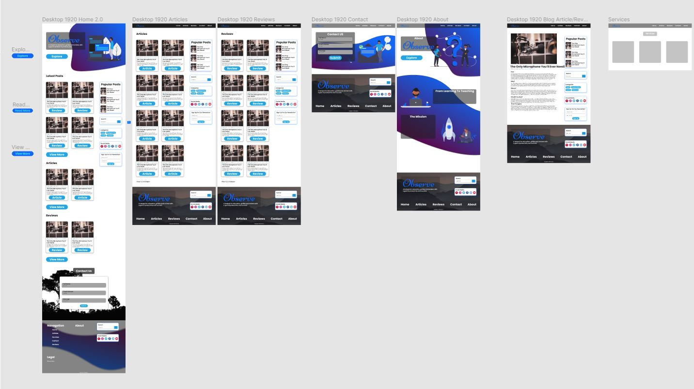

# Custom WordPress Site

## Technology/Skills Used

- UI/UX
- HTML5
- CSS3/Sass
- JavaScript
- JavaScript 3rd party libraries
- Git version control
- WordPress CMS (Custom post types, advanced customisation control, search funtionality, blog archives, contact form custom WordPress functions etc.)
- PHP

## Features

- Proper UI/UX Principles (Call to action, contrast, typography, hierarchy, clear and useable desgin)
- Fully responsive with cross browser support
- Tested using git + netlify hosting (https://github.com/simarubhi/blog-test)

## Figma UI Mockups

